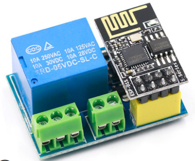
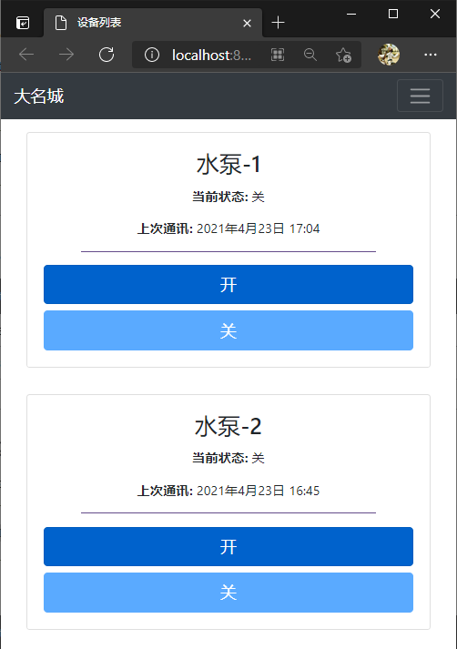

# Smart_Home

ESP8266(Arduino) + Django

Communication based on HTTP Get Protocol

NO fixed iP-address required for ESP8266

For ESP8266:
1. [ESP8266] -> "I`m [uuid]" -> [SERVER]
2. [SERVER] -> SELECT state in Clinet WHERE UUID = [uuid] -> Return HTTP-200 & State

For User:
1. [USER] -> HTTP-GET: serverIP/uuid/state -> UPDATE Client SET state = [state] WHERE uuid = [uuid]

---

